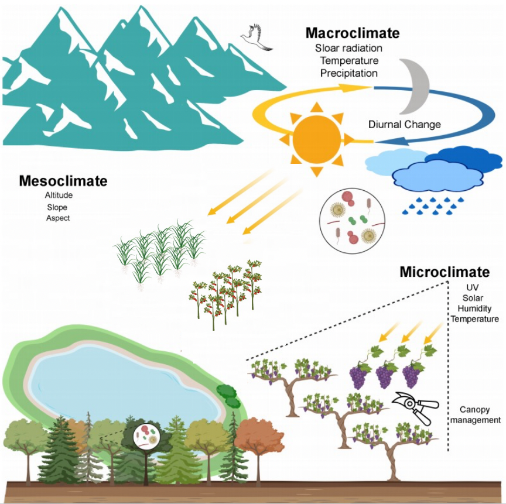

# Environmental modelling factors preparation

This repository contains a series of Jupyter notebooks designed for preparing various environmental datasets for use in remote sensing, agriculture, climate studies, and environmental modeling. All data utilized in these workflows is accessed and processed through Google Earth Engine (GEE), a powerful platform that enables efficient and scalable analysis of large geospatial datasets. Thanks to GEE for providing access to these valuable datasets.




## Notebooks Overview
### Sentinel-2-data-preparation.ipynb
This notebook provides a workflow for accessing and preparing Sentinel-2 multispectral data from GEE, focusing on spectral bands relevant to vegetation indices like NDVI. It includes cloud masking, spatial/temporal resampling, and preprocessing steps essential for environmental and agricultural analysis.

### Climate-features-preparation.ipynb
This notebook extracts climate-related features (temperature, precipitation, etc.) from GEE's extensive climate data archives. Data cleaning, anomaly handling, and feature engineering are covered to create a robust climate dataset for integrated analyses.

### Sentinel-1-feature-preparation.ipynb
Here, you’ll find methods for processing Sentinel-1 SAR data accessed from GEE. The notebook includes point based, time series and multitemporal image downloading ways.

### MODIS-vegetation-condition.ipynb
This notebook demonstrates how to prepare MODIS vegetation condition data from GEE. It focuses on time-series analysis and anomaly detection, allowing for the monitoring of vegetation health over time.

### Soil-attributes-preparation.ipynb
This notebook details the preparation of soil parameters (e.g., texture and organic matter) for environmental modelling using soil attribute datasets available on GEE.

### Landsat-data-preparation.ipynb
This notebook covers the processing of Landsat imagery from GEE. It includes steps like cloud masking and shows how to derive spectral indices useful for land cover and ecosystem analysis.

###  Terrain-feature-preparation.ipynb
This notebook focuses on deriving terrain features (elevation, slope, aspect) from digital elevation models available in GEE. These features are essential for hydrological and erosion studies and are processed to align with other environmental datasets.

By leveraging GEE, these notebooks streamline access to vast, high-quality environmental datasets, supporting efficient data preparation for various research and modelling applications. 

#### Various GEE download methods—such as point-based, time-series-based, single-image, and multi-temporal image downloads—can be easily adapted to retrieve other satellite datasets available through GEE.

# Reference

```bash
@article{zhao2023soil,
  title={Soil organic carbon estimation from climate-related features with graph neural network},
  author={Zhao, Weiying and Efremova, Natalia},
  journal={NeurIPS 2023 workshop: Tackling Climate Change with Machine Learning},
  year={2023}
}

@article{zhao2024soil,
  title={Soil nitrogen forecasting from environmental variables provided by multisensor remote sensing images},
  author={Zhao, Weiying and Chuluunbat, Ganzorig and Unagaev, Aleksei and Efremova, Natalia},
  journal={IGARSS 2024 - 2024 IEEE International Geoscience and Remote Sensing Symposium},
  year={2024}
}
